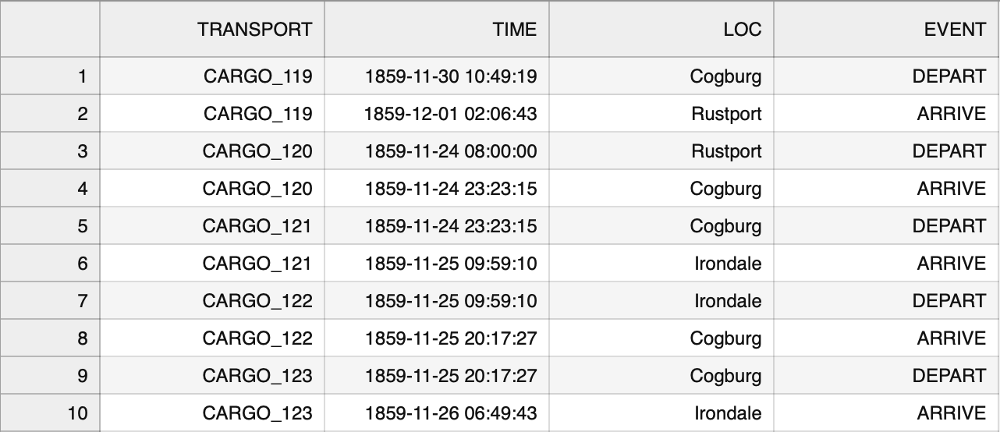
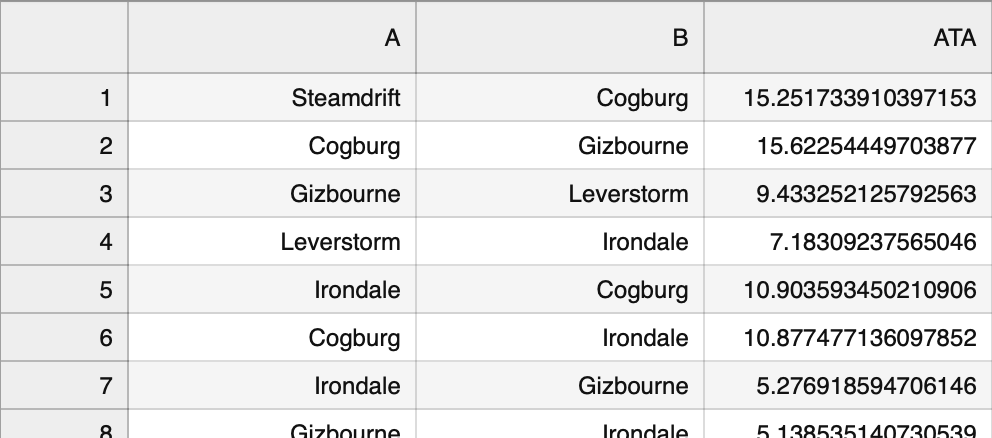

Previous: [Find shortest path on map](transport-tycoon_21.md) | [Index](transport-tycoon.md) 

# Episode 2.3: Mine historical data for travel speed

In the previous exercise we computed Estimated Time of Arrival (ETA) for a cargo truck. The truck moved between two locations with a predefined speed.

In the real world we would need to "mine" historical data in order to figure out the travel speed between locations. This is "training" data for the model from the previous exercises.

Also, in the real world we would need to validate the quality of our results. For example, by computing accuracy score.

## Training

We have a training dataset. It is a CSV file with the travel history. It looks like this:



This file is a travel log of a company that runs multiple trucks. Whenever there is a delivery from A to B:

- New row is added with a unique `transport_id`, timestamp, starting location and `DEPART` event
- One row is added for each intermediate and final milestone with `ARRIVE` event.

We can mine that file for a history of travel times between two locations: 

- load each trip from the file;
- for each road segment (there could be more than one) - compute time difference between the moment of departure and arrival.

Each road segment will probably have more than one _sample_ of time duration. Just like, in the real world, they could also be slightly different from each other.

We can reduce a collection of travel times into a single number by aggregating. 

Computing an *average* can be good enough for now: `travel_time = sum(travel_time_samples) / len(travel_time_samples)`

Given these numbers, you could plug them into the logistic model from the previous exercises. It will then be able to *predict* travel time between any two locations. 

## Validation

How do we validate our findings? How do we know if our predictions make any sense?

There is a separate dataset that we could use to validate our results.

This CSV files contains real (or *oserved*) travel times (in hours) between two locations (ATA stands for `Actual Time of Arrival`).

 

We could validate our model by going through each row in this validation dataset and computing the travel time that our model would predict. Then we compare results with the `ATA` column from this table.

```
PREDICTED TRAVEL TIME | ACTUAL TRAVEL TIME | ERROR      | NOTE
16:23:01              | 16:24:59           | ~2 minutes | This is quite good!
20:44:12              | 12:42:22           | ~8 hours   | The model is WAY off here
```

Smaller the difference between these numbers (or *error*)- more accurate the model is.

In order to communicate model accuracy to the others, we would need to somehow **aggregate all errors into a single model error**. 

Averaging over errors wouldn't work here. Imagine you have two travel results:

```
PREDICTED TRAVEL TIME | ACTUAL TRAVEL TIME | ERROR      |
1 hour                | 2 hours            | 1 hour     |
2 hours               | 1 hour             | -1 hour    |
```

If we average these two errors we would get `0` - which is the perfect score. 

Let's use *Mean Squared Error* (MSE) instead. It is good enough for this exercise.


The equation might look scary because of the notation. it simply means:

1. Compute *error* by substracting observed value from the predicted.
2. Compute a square of each error
3. Compute *mean* (also known as *average*) of these squared errors. 

In pseudocode this could look like:

```python
error_sum = 0
for loc_a, loc_b, actual_hours in test_dataset:
  preducted_hours = predict(loc_a, loc_b)
  difference = actual_hours - predicted_hours
  square = difference * difference
  error_sum += square
mse = error_sum / len(test_dataset)
print(f"Mean squared error is {mse}")
```


## Task

Write a console application that:

- uses training dataset `s02e03_train.csv` to compute average travel times for each road;
- predicts travel times in hours for each row in validation dataset  `s02e03_test.csv`;
- computes Mean Squared Error for these predictions and prints the result.

For example:

```
> python3 solution_s0203.py
MSE is 0.37877778702
```

The number above is just a sample. Your number will be slightly different :)

## Next

- Contribute your solution to [a list of all solutions](transport-tycoon/README.md)! Linked page explains how to do that.
- If you have any questions or comments - we have a [Discord chat](https://discord.gg/jHGbUwxDgv).
- Next episode will be published within 2 weeks. You can watch this repository or [subscribe to the mailing list](https://tinyletter.com/softwarepark).
- 🔜 Episode 2.4: Setting up training pipeline and iterating

